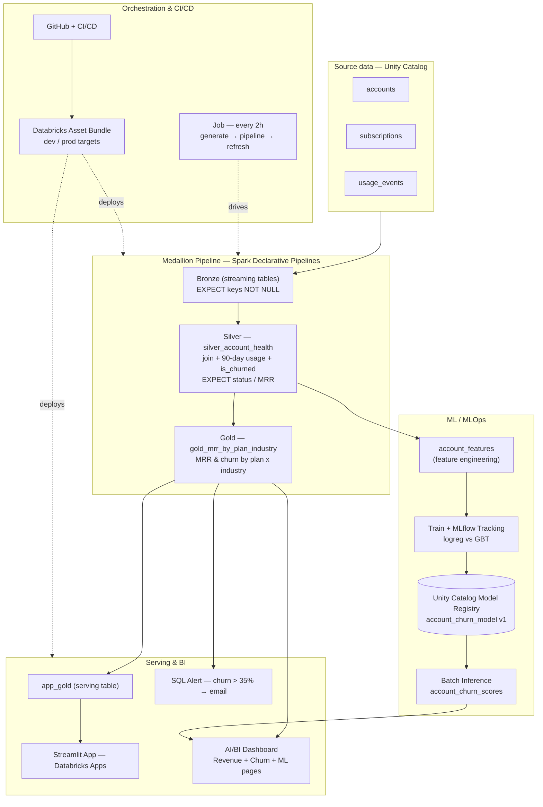
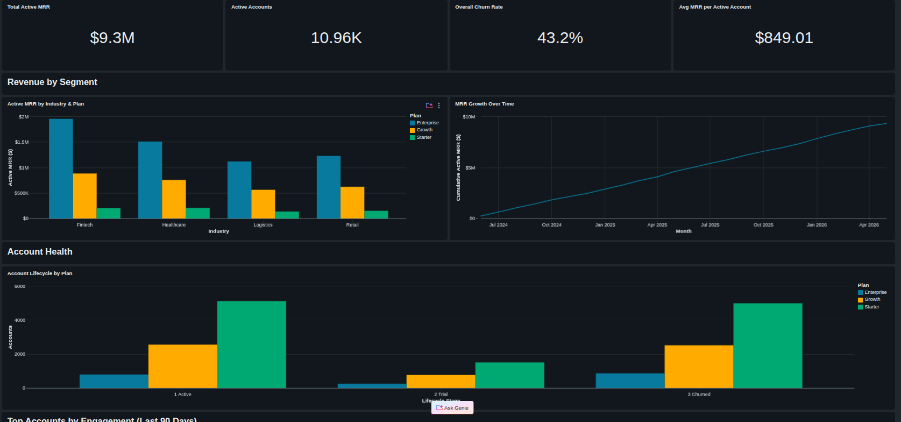
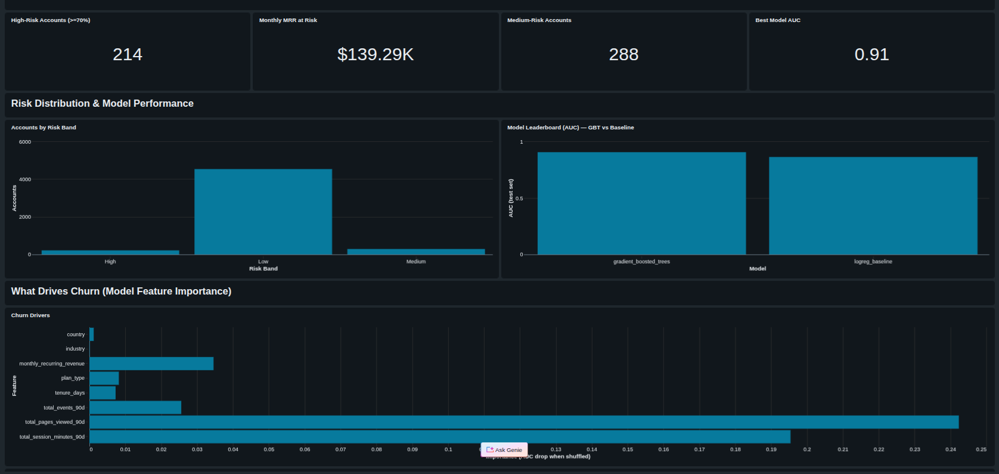
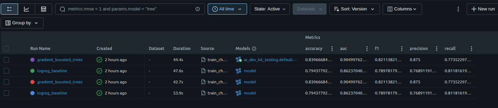
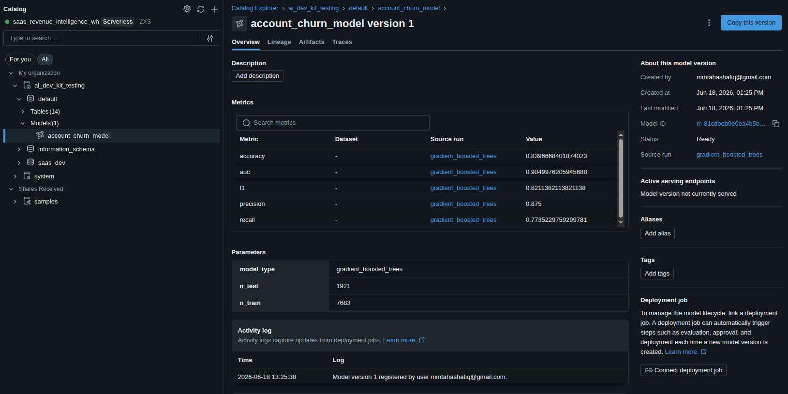
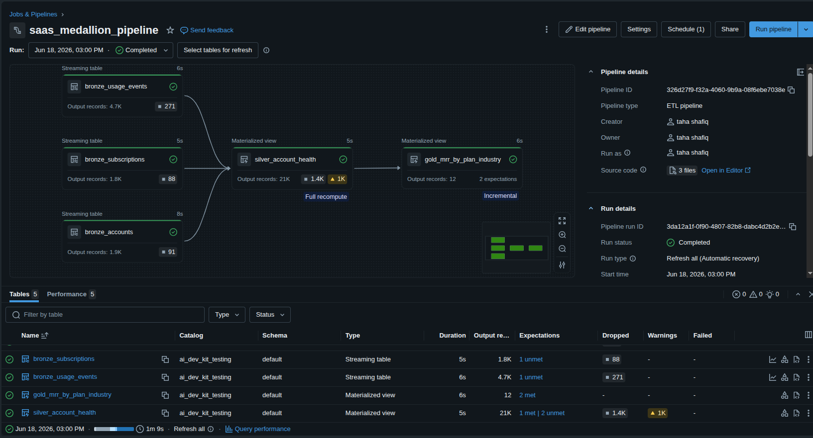
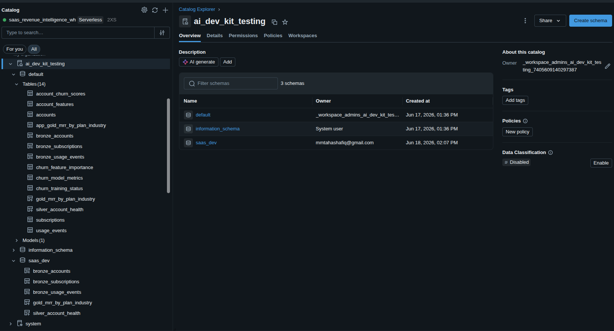

# 📊 SaaS Customer Churn Intelligence — End-to-End on Databricks

An end-to-end **data engineering + MLOps** project on Databricks: it takes raw SaaS
data all the way to a deployed churn-prediction system that produces a ranked list of
at-risk customers the business can act on — and ships the whole thing as
version-controlled, reproducible code.

> **Note:** Built on **synthetic data** as a personal, end-to-end learning project to
> demonstrate the full Databricks lifecycle (Lakehouse → BI → MLOps → CI/CD).

---

## 🎯 The problem
A subscription software company loses revenue when customers **churn** (cancel). The
goal: **predict who is about to churn, surface it to the team, and act before they leave.**

## 🏆 Results
| Metric | Value |
|---|---|
| Churn model (gradient-boosted trees) — test AUC | **0.905** |
| Baseline (logistic regression) — test AUC | 0.862 |
| High-risk active accounts identified | **214** |
| Monthly recurring revenue at risk | **~$139K** |
| Top churn driver | recent product usage (90-day pages/sessions) |

---

## 🏗️ Architecture



**Data flow in one line:** raw data → cleaned/aggregated (Medallion) → seen (dashboard/app)
→ watched (alert) → predicted (ML model) → acted on (at-risk list) → packaged (bundle).

---

## 🧰 Tech stack & skills demonstrated
| Area | What's used |
|---|---|
| **Data Engineering** | Medallion architecture, Spark Declarative Pipelines (Lakeflow), data-quality `EXPECT` constraints, Change Data Feed |
| **Lakehouse / Governance** | Unity Catalog (catalogs, schemas, tables, model registry, grants) |
| **Analytics / BI** | AI/BI (Lakeview) dashboard, Streamlit app on Databricks Apps |
| **MLOps** | MLflow tracking + model registry, feature engineering, model training/eval, batch inference |
| **DataOps / CI-CD** | Databricks Asset Bundles, dev/prod environments, Git |
| **Orchestration** | Databricks Jobs (multi-task DAG, scheduling), SQL Alerts |

---

## 🤖 The ML lifecycle (MLOps)
1. **Feature engineering** → `account_features`: one row per account (label `is_churned` +
   plan, tenure, MRR, 90-day usage), with nulls/negatives cleaned.
2. **Tracking** → trained a logistic-regression baseline and a gradient-boosted model;
   every run logged to **MLflow** (params, metrics, model artifact) for comparison.
3. **Registry** → registered the winner to **Unity Catalog** as `account_churn_model` v1
   (versioned, governed, loadable by name).
4. **Batch inference** → loaded the registered model and scored all active accounts into
   `account_churn_scores` (risk % + High/Medium/Low band) — the actionable output.

---

## 🗂️ Repository structure
```
databricks.yml                         # bundle config + dev/prod targets + variables
resources/
  pipeline.yml                         # medallion pipeline (bronze → silver → gold)
  job.yml                              # 2-hourly: generate → pipeline → refresh
  dashboard.yml                        # AI/BI dashboard
src/
  pipelines/medallion/transformations/ # pipeline SQL (with EXPECT data-quality rules)
  notebooks/                           # data generator + serving-table refresh
  dashboards/saas_churn.lvdash.json    # exported dashboard definition
  app/                                 # Streamlit app
  ml/                                  # train_churn.py + score_churn.py (MLflow + UC)
docs/screenshots/                      # screenshots used in this README
```

---

## 🚀 How to deploy (Databricks Asset Bundle)
```bash
export DATABRICKS_CONFIG_PROFILE=DEFAULT

databricks bundle validate -t dev        # check config (the CI step)
databricks bundle deploy   -t dev        # build resources (dev-prefixed, isolated in saas_dev)
databricks bundle run medallion -t dev   # run the pipeline
databricks bundle destroy  -t dev        # tear it all down

# promote to production:
databricks bundle deploy -t prod
```
- **dev** (`mode: development`): every resource is prefixed `[dev <you>]`, schedules are
  auto-paused, and outputs go to a separate `saas_dev` schema — safe to experiment.
- **prod** (`mode: production`): writes to `default`, requires an explicit `root_path`.

The model (`src/ml/train_churn.py`, `score_churn.py`) and the Streamlit app are run/deployed
separately (see each file).

---

## 📸 Screenshots
> Add PNGs to `docs/screenshots/` with the filenames below and they'll render here.

### AI/BI Dashboard — Revenue & Churn


### AI/BI Dashboard — Churn Risk (ML)


### MLflow — experiment runs (model comparison)


### Unity Catalog — registered model


### Pipeline DAG (bronze → silver → gold)


### Unity Catalog — dev vs prod isolation (saas_dev vs default)


<!--
SCREENSHOT CAPTURE GUIDE (replace <host> with your workspace host):
  dashboard-revenue.png  -> open the dashboard, "Revenue & Churn" page
  dashboard-ml.png       -> dashboard, "Churn Risk (ML)" page
  mlflow-experiment.png  -> <host>/ml/experiments/<experiment-id>  (tick both runs -> Compare)
  mlflow-model.png       -> Catalog -> Models -> account_churn_model -> version 1
  pipeline-dag.png       -> open the pipeline, the graph view
  catalog-dev-prod.png   -> Catalog -> ai_dev_kit_testing  (show 'default' and 'saas_dev')
-->

---

## 💡 What I learned
- **MLOps is the system, not the model** — tracking, registry, environments, and CI/CD
  matter as much as model accuracy.
- **Environment isolation** (dev vs prod, separate schemas) lets you experiment without risk.
- **Infrastructure as code** (Asset Bundles) turns a pile of hand-built resources into a
  reproducible project anyone can deploy with one command.
- **Data quality gates** (`EXPECT` constraints) catch bad data automatically in the pipeline.
