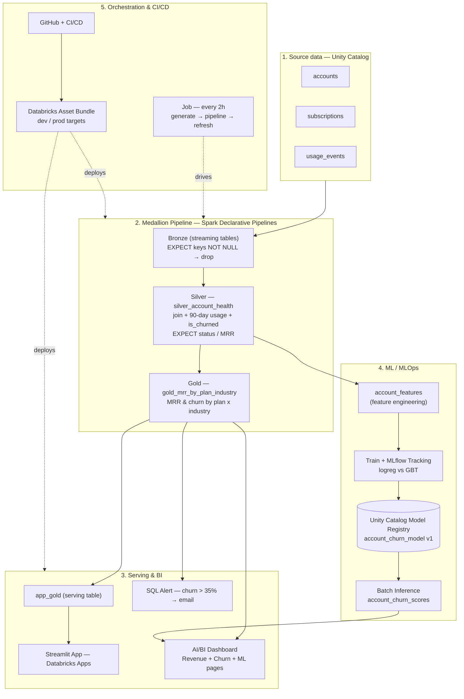

# 📊 Databricks Customer Predictive Retention

An **end-to-end data engineering + MLOps platform** built on Databricks that takes raw
SaaS data all the way to a deployed churn-prediction system — producing a ranked list of
at-risk customers the business can act on — and ships the whole thing as version-controlled,
reproducible code (Databricks Asset Bundles).

> Built on **synthetic data** as a personal, end-to-end learning project to demonstrate the
> full Databricks lifecycle: **Lakehouse → BI → MLOps → CI/CD**.

---

## 🎯 The problem it solves
A subscription software company loses revenue when customers **churn** (cancel). Knowing a
customer *already* churned is useless — the value is in catching customers who are **still
here but heading for the exit**, early enough to intervene. This project builds the full
system to **predict who will churn, surface it, and act on it.**

## 🏆 Results at a glance
| Metric | Value |
|---|---|
| Churn model — gradient-boosted trees (test AUC) | **0.905** |
| Baseline — logistic regression (test AUC) | 0.862 |
| Active accounts scored | 5,035 |
| **High-risk** accounts flagged (≥70%) | **214** |
| Monthly recurring revenue at risk | **~$139K** |
| Strongest churn driver | recent product usage (90-day pages / session minutes) |

---

## 🏗️ Architecture



---

## 🔄 End-to-end flow (step by step)

### Step 1 — Generate the data
**What:** Three source Delta tables of a fictional SaaS company in `ai_dev_kit_testing.default`:
- `accounts` (5,000) — company, industry, `plan_type` (Starter/Growth/Enterprise, weighted 60/30/10), country, contract start date
- `subscriptions` (5,000) — MRR, `status` (active/churned/trial), renewal date
- `usage_events` (50,000) — product events, session minutes, pages viewed

**Why:** A realistic dataset with a *story* baked in — Enterprise accounts earn more and use
more; churned accounts show **declining usage in the 60 days before renewal** (the signal the
model later learns).
**How:** Generated with Spark + Faker via Databricks Connect on serverless compute.

### Step 2 — Medallion pipeline (Bronze → Silver → Gold)
A **Spark Declarative Pipeline** turns raw data into analytics-ready tables, with
**data-quality `EXPECT` constraints on every layer** (tracked in the pipeline event log):

| Layer | Table(s) | Transformation | Data-quality rule |
|---|---|---|---|
| **Bronze** | `bronze_accounts`, `bronze_subscriptions`, `bronze_usage_events` | Stream raw sources via `STREAM(table)` (Change Data Feed enabled) | keys `NOT NULL` → **drop** |
| **Silver** | `silver_account_health` | Join subscriptions ⋈ accounts, add `is_churned`, compute **90-day usage** per account | `status` valid → drop · `mrr >= 0` → warn · `account_id NOT NULL` → fail |
| **Gold** | `gold_mrr_by_plan_industry` | Aggregate MRR & churn by `plan_type` × `industry` | `account_count > 0` → fail · `active_mrr >= 0` → warn |

**Why the layers:** Bronze = raw history, Silver = cleaned & enriched per-account view,
Gold = business-ready aggregates. This is the standard **Medallion architecture**.

### Step 3 — Serving & BI (see it + watch it)
- **`app_gold_mrr_by_plan_industry`** — a plain serving snapshot of Gold (so the app's service
  principal can read it without materialized-view permission issues).
- **Streamlit app** on Databricks Apps — interactive revenue/churn view.
- **AI/BI dashboard** — KPIs + charts across two pages (Revenue & Churn, and Churn Risk/ML).
- **SQL Alert** — emails automatically when overall churn rate exceeds **35%**.

### Step 4 — Automation (run it by itself)
A **Databricks Job runs every 2 hours** with a 3-task DAG:
`generate messy data → run pipeline → refresh serving table`.
The generator deliberately injects **bad rows** (null keys, invalid status, negative MRR) so the
pipeline's `EXPECT` constraints are continuously exercised and visible in the event log. The
dashboard auto-refreshes every 2 hours too.

### Step 5 — Feature engineering for ML
**`account_features`** — one row per account, the model's input:
- **Label:** `is_churned` (1/0)
- **Features:** plan_type, industry, country, tenure (days since contract start), MRR, and 90-day
  usage (events, session minutes, pages viewed)
- **Cleaning:** null/negative MRR floored to 0, categoricals coalesced, deduped to one row/account.

### Step 6 — Train & track (MLflow)
Two models trained and **logged to MLflow** (params, metrics, model artifact):
- Logistic Regression (baseline) → **AUC 0.862**
- Gradient-Boosted Trees (winner) → **AUC 0.905**

MLflow makes the runs **comparable and reproducible** — that's the "Ops" in MLOps.

### Step 7 — Register the model (Unity Catalog)
The winning model is registered as **`account_churn_model` v1** in the Unity Catalog model
registry — versioned, governed, and loadable **by name** (not by file path).

### Step 8 — Batch inference (the payoff)
The registered model is loaded and used to score all **5,035 active accounts** into
**`account_churn_scores`** — each with a churn probability and a High/Medium/Low band. Result:
**214 high-risk accounts (~$139K MRR)** for the customer-success team to contact.

### Step 9 — Package & ship (Asset Bundle + CI/CD)
The entire project is defined as code in a **Databricks Asset Bundle** with `dev` and `prod`
targets. One command (`databricks bundle deploy`) rebuilds the whole project in any workspace —
the foundation for Git + CI/CD deployment.

---

## 🧰 Tech stack & skills demonstrated
| Area | What's used |
|---|---|
| **Data Engineering** | Medallion architecture, Spark Declarative Pipelines (Lakeflow), data-quality `EXPECT` constraints, Change Data Feed |
| **Lakehouse / Governance** | Unity Catalog (catalogs, schemas, tables, model registry, grants) |
| **Analytics / BI** | AI/BI (Lakeview) dashboard, Streamlit app on Databricks Apps |
| **MLOps** | MLflow tracking + model registry, feature engineering, model training/eval, batch inference |
| **DataOps / CI-CD** | Databricks Asset Bundles, dev/prod environments, Git |
| **Orchestration** | Databricks Jobs (multi-task DAG, scheduling), SQL Alerts |

---

## 🗂️ Repository structure
```
databricks.yml                         # bundle config + dev/prod targets + variables
resources/
  pipeline.yml                         # medallion pipeline (bronze → silver → gold)
  job.yml                              # 2-hourly: generate → pipeline → refresh
  dashboard.yml                        # AI/BI dashboard
src/
  pipelines/medallion/transformations/ # pipeline SQL (with EXPECT data-quality rules)
    01_bronze.sql  02_silver.sql  03_gold.sql
  notebooks/                           # generate_messy_batch.py + refresh_app_serving_table.sql
  dashboards/saas_churn.lvdash.json    # exported dashboard definition
  app/                                 # Streamlit app (app.py, app.yaml, requirements.txt)
  ml/                                  # train_churn.py + score_churn.py (MLflow + UC)
docs/screenshots/                      # screenshots used below
```

---

## 🚀 How to deploy
```bash
export DATABRICKS_CONFIG_PROFILE=DEFAULT

databricks bundle validate -t dev        # check config (the CI step)
databricks bundle deploy   -t dev        # build resources (dev-prefixed, isolated in saas_dev)
databricks bundle run medallion -t dev   # run the pipeline
databricks bundle destroy  -t dev        # tear it all down

# promote to production:
databricks bundle deploy -t prod
```
- **dev** (`mode: development`): every resource is prefixed `[dev <you>]`, schedules are
  auto-paused, and outputs go to a separate **`saas_dev`** schema — safe to experiment.
- **prod** (`mode: production`): writes to `default`, requires an explicit `root_path`.

> The ML scripts (`src/ml/`) and the Streamlit app are run/deployed separately.

---

## 📸 Screenshots

### AI/BI Dashboard — Revenue & Churn


### AI/BI Dashboard — Churn Risk (ML)


### MLflow — experiment runs (model comparison)


### Unity Catalog — registered model


### Pipeline DAG (bronze → silver → gold)


### Unity Catalog — dev vs prod isolation (saas_dev vs default)


---

## 💡 What I learned
- **MLOps is the *system*, not the model** — tracking, registry, environments, and CI/CD matter
  as much as model accuracy.
- **Environment isolation** (dev vs prod, separate schemas) lets you experiment without risk.
- **Infrastructure as code** (Asset Bundles) turns a pile of hand-built resources into a
  reproducible project anyone can deploy with one command.
- **Data-quality gates** (`EXPECT` constraints) catch bad data automatically inside the pipeline.
- **The label is the past; the model is the future** — `is_churned` records who *already* left;
  the model scores current customers so you can act *before* they do.
